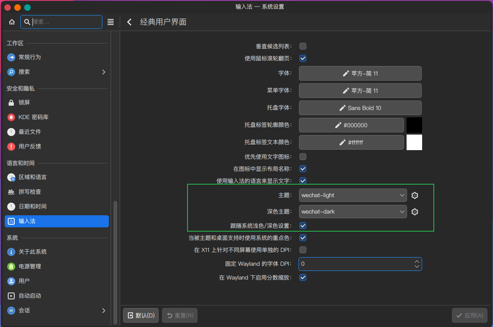

<h1 align="center">仿微信的fcitx5输入法框架皮肤</h1>


### 效果图
* 深色


* 亮色


### 安装

#### 1.源码安装

> 适用所有发行版

```shell
git clone https://github.com/witt-bit/fcitx5-theme-wechat.git

# 深色
cp -r fcitx5-theme-wechat/wechat-dark /usr/share/fcitx5/themes/
# 亮色
cp -r fcitx5-theme-wechat/wechat-light /usr/share/fcitx5/themes/
```

#### 2.AUR安装

> 适用Arch Linux和Manjaro

```shell
yay -S fcitx5-theme-wechat
```

### 使用

在**系统设置**-->**输入法**-->**配置附加组件**-->**经典用户界面**-->**主题/深色主题**选择启用


